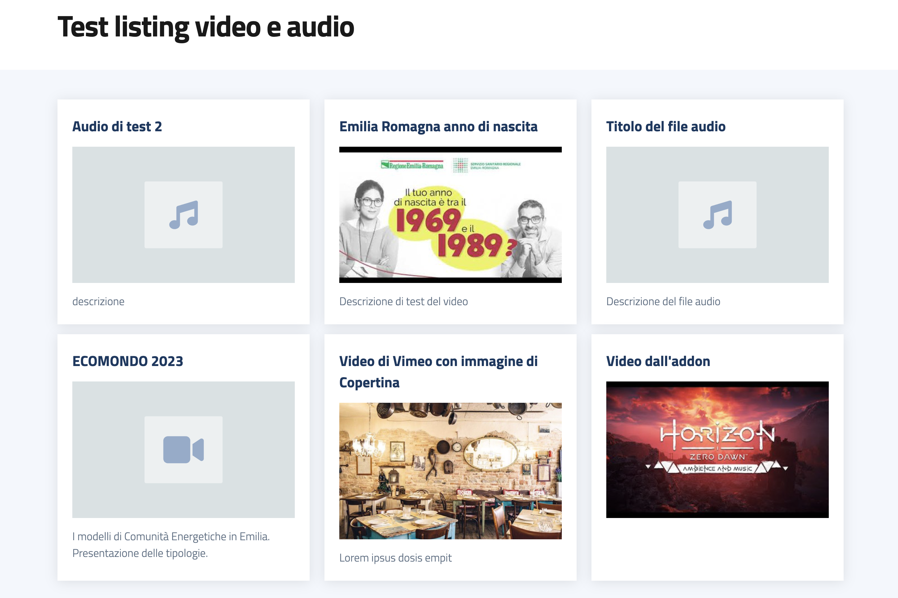

# Volto WildCard Media addon

This Volto Addon uses https://github.com/collective/wildcard.media package and design-comuni-plone-theme dependencies https://github.com/italia/design-comuni-plone-theme.

Features
--------

- Audio and Video content-type view
- New listing variation "MediaWithModalTemplate"

To be used with mrs-developer, see [Volto docs](https://docs.voltocms.com/customizing/add-ons/) for further usage informations.

